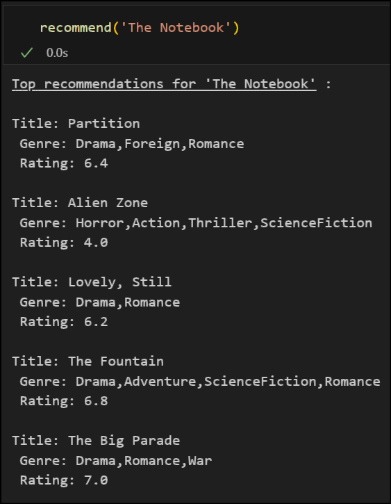

# Movie Recommendation Model using NLP Techniques

Welcome to the **Movie Recommendation Model** repository! This project leverages Natural Language Processing (NLP) to create a content-based movie recommendation system. By analyzing metadata from movies, such as genres, keywords, cast, crew, and plot summaries, the model provides personalized movie recommendations.

## 📝 Overview

With the explosion of content in the entertainment industry, finding a movie that suits your taste can be overwhelming. This project aims to simplify this process by recommending movies based on your preferences. Using advanced NLP techniques, this model processes and understands movie metadata to suggest movies that are similar to ones you already like.

## 🚀 Features

- **Content-Based Filtering**: Recommends movies by analyzing the similarity of movie metadata.
- **NLP Techniques**: Employs tokenization, stemming, and vectorization to process textual data effectively.
- **Cosine Similarity**: Measures the similarity between movies by comparing their processed tags.
- **Interactive Recommendations**: Simple and intuitive interface to get recommendations based on a selected movie.

## 📊 Dataset

The model uses the **TMDB5000 Movie Dataset**. Ensure that you have the following files in the specified directory:
- `tmdb_5000_credits.csv`
- `tmdb_5000_movies.csv`

## 📂 File Structure

```
├── main.ipynb               # Jupyter Notebook with the main code and analysis
├── tmdb_5000_movies.csv     # Dataset containing movie metadata
├── tmdb_5000_credits.csv    # Dataset containing movie credits
└── README.md                # Project documentation
```

## 🛠️ Installation & Setup

1. **Clone the repository**:
   ```bash
   git clone https://github.com/yajasarora/Movie-Recommendation-Model.git
   cd Movie-Recommendation-Model
   ```

2. **Install the required dependencies**:
   Make sure you have Python 3.x installed. Then, install the necessary packages:
   ```bash
   pip install -r requirements.txt
   ```

3. **Run the Jupyter Notebook**:
   Start Jupyter Notebook and open `main.ipynb` to explore the project:
   ```bash
   jupyter notebook main.ipynb
   ```

## 🧑‍💻 Usage

1. **Load the data**: The notebook will guide you through loading the `tmdb_5000_movies.csv` and `tmdb_5000_credits.csv` files.
2. **Preprocess the data**: Follow the steps in the notebook to preprocess the data, including text processing and vectorization.
3. **Generate Recommendations**: Select a movie and get recommendations based on the similarity score calculated using cosine similarity.

## 📈 Results

The model provides a list of movies similar to the one you select. You can tweak the parameters or explore different NLP techniques to improve the recommendations.

## 🎨 Visuals

 <!-- Replace with actual image link -->

## 🌟 Future Work

- **Incorporate User Ratings**: Integrate collaborative filtering by considering user ratings to enhance recommendations.
- **Improve Text Processing**: Experiment with more sophisticated NLP techniques like word embeddings or transformers.
- **Deploy as a Web Application**: Convert the notebook into a web application using Flask or Streamlit for broader accessibility.

## 🤝 Contributions

Contributions are welcome! If you have ideas to improve this project, feel free to fork the repository and submit a pull request.

## 📬 Contact

For any questions or feedback, feel free to reach out via GitHub Issues.

---

Happy Coding! 🚀
